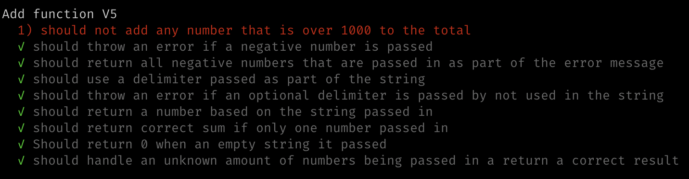
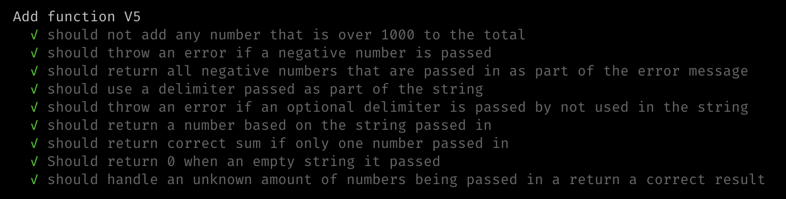

## String Calculator V5

Numbers bigger than 1000 should be ignored, so adding 2 + 1001 = 2

### Steps

1. Write units tests to cover contidions, watch them fail:

2. Write simplest code to get tests to pass. (`src/v5/index.js`)

3. Re run tests!

4. Refactor code.