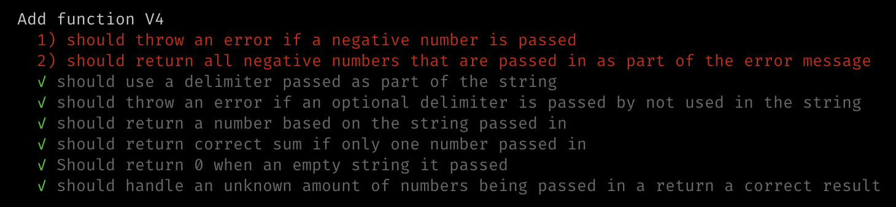
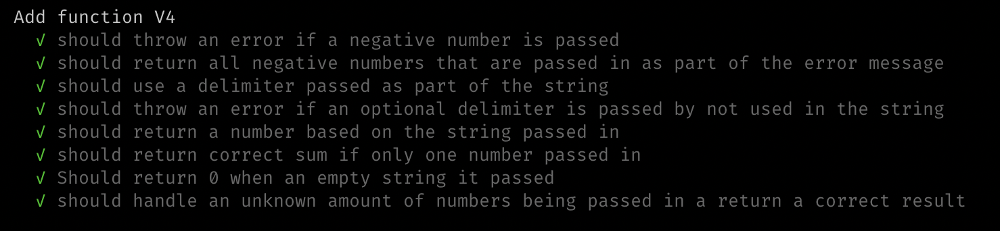

## String Calculator V4

Calling Add with a negative number will throw an exception “negatives not allowed” and the negative that was passed. If there are multiple negatives, show all of them
in the exception message.

### Steps

1. Write units tests to cover contidions, watch them fail:

2. Write simplest code to get tests to pass. (`src/v4/index.js`)

3. Re run tests!

4. Refactor code.