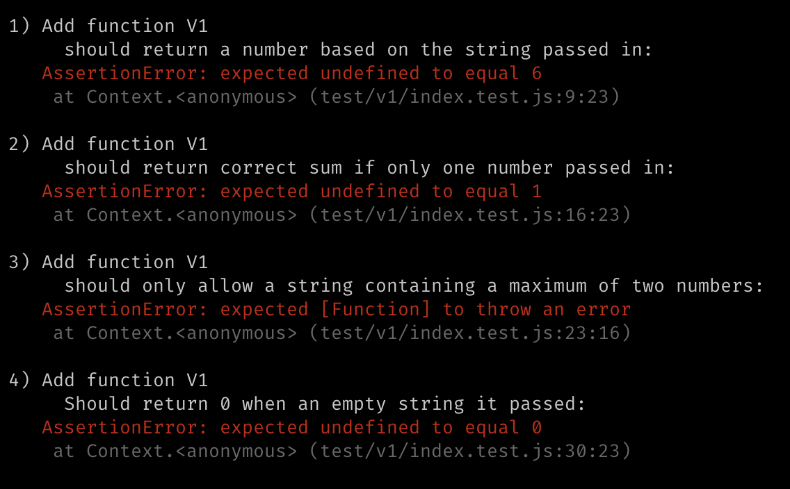
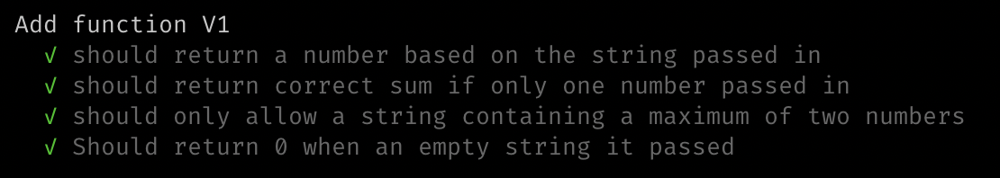

## String Calculator V1

The method can take up to two numbers, separated by commas, and will return
their sum.

### Steps

1. Write units tests to cover contidions, watch them fail:

2. Write simplest code to get tests to pass. (`src/v1/index.js`)

3. Re run tests!

4. Refactor code.
