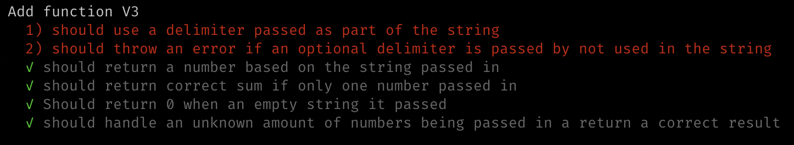

## String Calculator V3

Support different optional delimiters.

### Steps

1. Write units tests to cover contidions, watch them fail:

2. Write simplest code to get tests to pass. (`src/v3/index.js`)

3. Re run tests!

4. Refactor code.