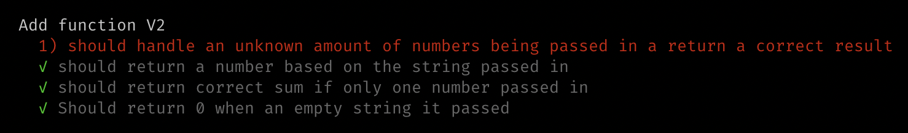
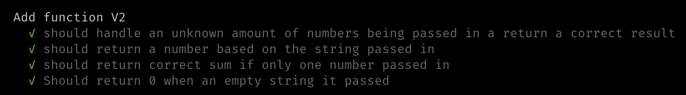

## String Calculator V2

Allow the Add method to handle an unknown amount of numbers

### Steps

1. Write units tests to cover contidions, watch them fail:

2. Write simplest code to get tests to pass. (`src/v2/index.js`)

3. Re run tests!

4. Refactor code.